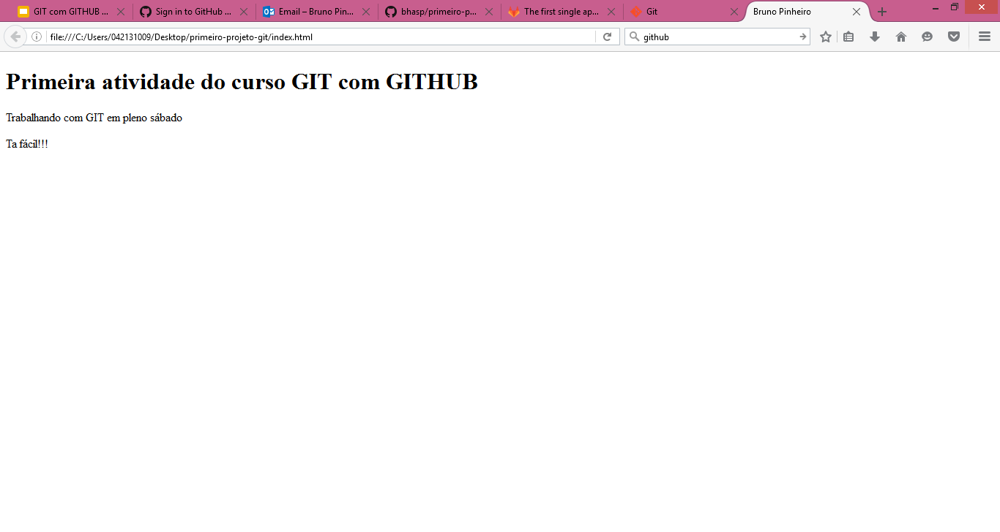

# Primeira atividade no curso de GIT com GITHUB

Atividade realizada no dia 17/11/2018, na UNIFACS Paralela!

  - Desenvolvedor: Bruno Pinheiro
  - Instrutor: Víctor Romário

### Descrição:
> Página simples em HTML, com o objetivo de exemplificar a alteração, criação e submissão de um projeto ao GITHUB, comk o GIT.

Tecnologias utilizadas no projeto:
* HTML
* [GIT](https://git-scm.com/)
* Markdown

### Comandos do GIT aprendidos até aqui:

```sh
$ git config --global user.name "seu nome"
$ git config --global user.email seu e-mail
```
Após a criação do projeto no computador:

```sh
$ cd Desktop/primeiro-projeto-git
$ git init
$ git status
$ git add .
$ git commit -m "mensagem"
$ git log
```
Submissão para o GITHUB:
```sh
$ git remote add origin endereçoHTTPSdoRepositorio
$ git push -u origin master
```
### Imagem da Página

